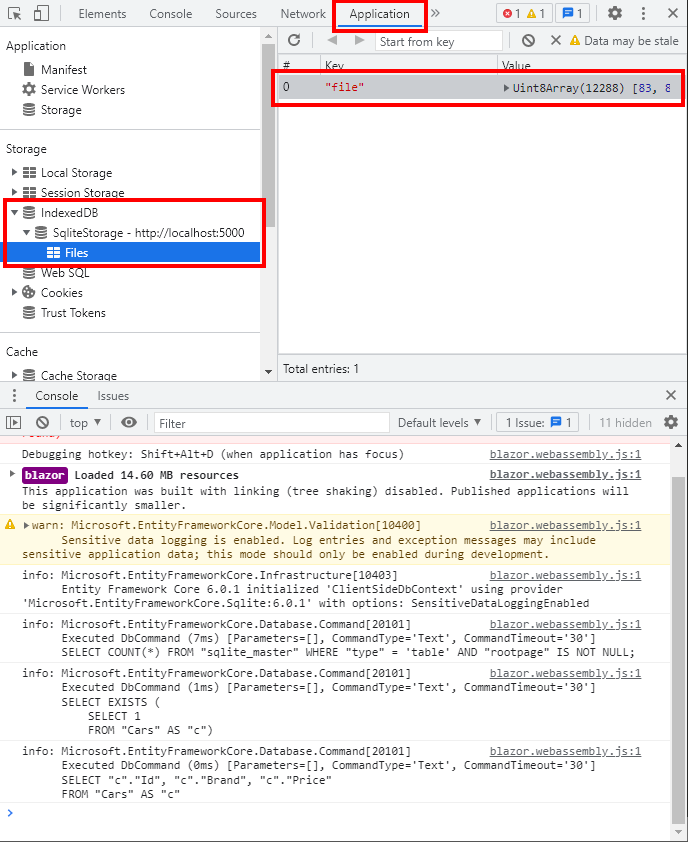

# Blazor + EF Core + SQLite + WebAssembly

Showing how to integrate _SQLite_ into a _Blazor_ wasm app which runs completely
inside the browser!


## Prerequisites
* .NET Core 6
* `wasm-tools` workload
<details>

  ```bash
  $ sudo dotnet workload install wasm-tools
  ```
</details>

* Microsoft Visual Studio 2022
* JetBrains Rider
* Visual Studio Code
* Google Chrome
  * should work in other browsers which support wasm

## Getting Started

<details>

### Building

```bash
$ git clone https://github.com/TrevorDArcyEvans/BlazorSQLiteWasm.git
$ cd BlazorSQLiteWasm
$ dotnet build
$ dotnet run
```
open [BlazorSQLiteWasm](http://localhost:5000)

### Debugging
* open _BlazorSQLiteWasm.sln_ in _Visual Studio 2022_
* _F5_ to run will open a browser and load wasm

Debugging _should_ also work with the latest _JetBrains Rider_

### Rebuilding `e_sqlite3.o`

This file is currently supplied as a binary blob but can easily be
regenerated from _SQLite_ source code and _emscripten_.

<details>

```bash
$ git clone https://github.com/cloudmeter/sqlite
$ cd sqlite
$ emcc sqlite3.c -shared -o e_sqlite3.o
```

Ignore warnings (!)

</details>

</details>

## How It Works

<details>

This project is largely based on demo code from [BlazeOrbital](https://github.com/SteveSandersonMS/BlazeOrbital)
and requires a number of coordinated and cooperating parts.

### C# .NET
* application code
* Entity Framework Core
* EF Core SQlite provider

is all compiled into the final wasm file.

### Javascript
A small piece of [helper code](./wwwroot/dbstorage.js) is required to create an _SQLite_ database file in the browser.
This is called from C# application code via .NET-javascript interop, _IJSRuntime_.  The database file is created on a
per-user basis and is persistent between browser sessions.
<p/>



There is some additional code:

```javascript
    setInterval(() => {
      const path = `/${filename}`;
      if (FS.analyzePath(path).exists) {
        const mtime = FS.stat(path).mtime;
        if (mtime.valueOf() !== lastModifiedTime.valueOf()) {
          lastModifiedTime = mtime;
          const data = FS.readFile(path);
          db.result.transaction('Files', 'readwrite').objectStore('Files').put(data, 'file');
        }
      }
    }, 1000);
```

which runs every second.  This is an artefact from the original [BlazeOrbital](https://github.com/SteveSandersonMS/BlazeOrbital)
project which required the data to be synchronised every second; and is not required for this example.

### emscripten
_SQLite_ C source code is compiled by _emscripten_ to a shared library, `e_sqlite.o`, which is then
linked into the final wasm file.  This is required by _EF Core SQLite_ provider.


### Schema updates
If more properties are added to _Car_ class, the application will throw EF Core exception.  This is because the class and
and underlying database schema are now mismatched.  The database needs to be rebuilt and, during testing and development, 
this can be done by running:

```csharp
await db.Database.EnsureDeletedAsync();
await db.Database.EnsureCreatedAsync();
```

For production, you could follow the guide
[here](https://docs.microsoft.com/en-us/ef/core/managing-schemas/migrations/applying?tabs=dotnet-core-cli#apply-migrations-at-runtime)

</details>

## Further Information

<details>

* [BlazeOrbital](https://github.com/SteveSandersonMS/BlazeOrbital)
* [`WasmBuildNative`](https://github.com/dotnet/AspNetCore.Docs/issues/24443)
* [webassembly native dependencies](https://docs.microsoft.com/en-us/aspnet/core/blazor/webassembly-native-dependencies?view=aspnetcore-6.0)
* [Uno Platform based SQLitePCLRaw provider for WebAssembly](https://github.com/unoplatform/Uno.SQLitePCLRaw.Wasm)
* [How do I call SQLitePCL.Batteries.Init().?](https://stackoverflow.com/questions/50746465/how-do-i-call-sqlitepcl-batteries-init)
* [SQLite-net](https://github.com/praeclarum/sqlite-net)
* [Sqlite database for WebAssembly](https://github.com/unoplatform/Uno.Samples/tree/master/UI/SQLiteSample)
* [sqlite](https://github.com/cloudmeter/sqlite)
* [emscripten](https://emscripten.org/)

</details>

## Acknowledgements
* <div>Icons made by <a href="https://www.freepik.com" title="Freepik">Freepik</a> from <a href="https://www.flaticon.com/" title="Flaticon">www.flaticon.com</a></div>
* <div>Icons made by <a href="https://www.flaticon.com/authors/eucalyp" title="Eucalyp">Eucalyp</a> from <a href="https://www.flaticon.com/" title="Flaticon">www.flaticon.com</a></div>

