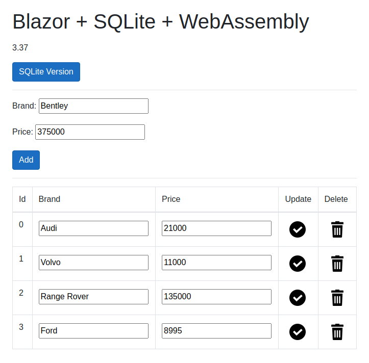

# Blazor + SQLite + WebAssembly

Showing how to integrate _SQLite_ into a _Blazor_ wasm app which runs completely
inside the browser.



## Prerequisites
* .NET Core 6
* Microsoft Visual Studio 2022
* Google Chrome
  * should work in other browsers which support wasm

**Debugging of wasm does not work on _JetBrains Rider 2021.3_**

## Getting Started

<details>

### Building

```bash
$ dotnet build
```

### Debugging
* open _BlazorSQLiteWasm.sln_ in _Visual Studio 2022_
* _F5_ to run will open a browser and load wasm

### Rebuilding `e_sqlite3.o`

This file is currently supplied as a binary blob but can easily be
regenerated from _SQLite_ source code and _emscripten_.

<details>

```bash
$ git clone https://github.com/cloudmeter/sqlite
$ cd sqlite
$ emcc sqlite3.c -shared -o e_sqlite3.o
```

Ignore warnings (!)

</details>

</details>

## Further Information

<details>

* [Uno Platform based SQLitePCLRaw provider for WebAssembly](https://github.com/unoplatform/Uno.SQLitePCLRaw.Wasm)
* [How do I call SQLitePCL.Batteries.Init().?](https://stackoverflow.com/questions/50746465/how-do-i-call-sqlitepcl-batteries-init)
* [SQLite-net](https://github.com/praeclarum/sqlite-net)
* [Sqlite database for WebAssembly](https://github.com/unoplatform/Uno.Samples/tree/master/UI/SQLiteSample)
* [BlazeOrbital](https://github.com/SteveSandersonMS/BlazeOrbital)
* [sqlite](https://github.com/cloudmeter/sqlite)
* [emscripten](https://emscripten.org/)

</details>

## Acknowledgements
* <div>Icons made by <a href="https://www.freepik.com" title="Freepik">Freepik</a> from <a href="https://www.flaticon.com/" title="Flaticon">www.flaticon.com</a></div>
* <div>Icons made by <a href="https://www.flaticon.com/authors/eucalyp" title="Eucalyp">Eucalyp</a> from <a href="https://www.flaticon.com/" title="Flaticon">www.flaticon.com</a></div>

